# Главная

Карта кастомки:

    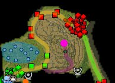
Оранжевая точка - шахта

синяя область - место добычи очков улучшения

желтая линия - маршрут лайновых крипов
фиолетовая линия - дорога к Рошану
зелёный линия - маршрут каравана (от красной базы к нижним башням)

Красные постройки справа сверху - база противника
Зелёные постройки слева снизу - ваша база

# Глава 1: Ты куда лезешь?

    Первым делом наводимся на основное меню, которое обозначено оранжевым треугольником:

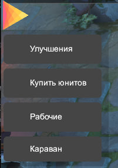

    Затем, заходим в "Купить юнитов" и выбираем одного из четырех юнитов, которые существуют в нашей кастомке.

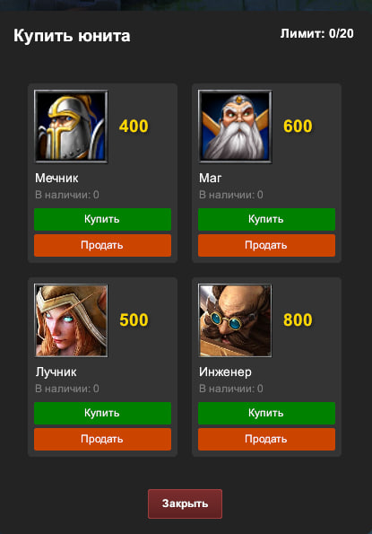

    Хочу заметить, что на всю команду лимит юнитов 20, то есть если вы играете с другом,  то лимит будет у вас не 20, а 10. Если будете 3 игрока, то по 7 юнитов и так далее.

    Продажа унитов возвращает вам 75% от их стоимости.

## После покупки юнита

    Мы выбираем один из путей для прокачки одного из юнитов (вы можете и прокачивать всех юнитов, но это не будет иметь такой эффект). 

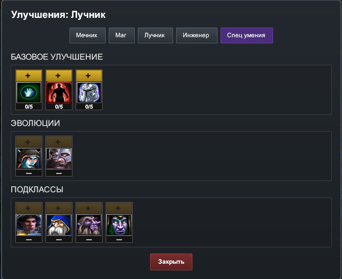

    У каждого улучшения есть свое описание (появляется при наведении на "+"). Каждое улучшение можно купить за очки улучшения (далее ОУ). Каждая эволюция - отдельный путь, если вы выбрали эволюцию A, то эволюция B для юнита будет закрыта и вытекающие из нее подклассы. Более подробно узнать о том, какая эволюция отвечает за подкласс можно узнать в описании подклассов. 

    Также для того, чтобы прокачать эволюцию/подкласс нужно выполнить требования по прокачке базовых улучшений. Все это описано в описании прокачки эволюций и подклассов.

## Что такое ОУ как их заработать и где их искать?

    ОУ - это, как было сказано ранее, очки улучшения. Они нужны для прокачки улучшений юнитов, от базовых улучшений до улучшений прокачек подклассов и эволюций.

    Чтобы заработать ОУ вам нужно пойти в лес (и закопать себя) самим убивать крипов-кабанов или же ждать, пока ваш охотник это сделает за вас (в лесу при этом не обязательно сидеть, как его любящая мама. Этот синдром оставьте где-то за игрой). Вот так выглядит эта мразь, запомните ее, потом напомните:

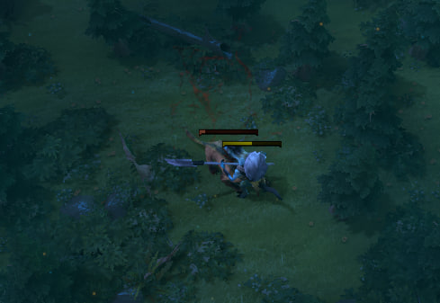

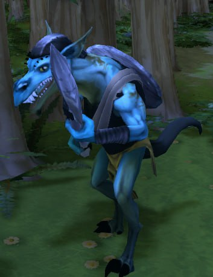

    Перед тем как продолжить рассказывать о ОУ нужно найти этого зверя в интерфейсе (его индикацию)

    Сейчас хорошо открываем свои глазки и смотрим на этот скриншот:

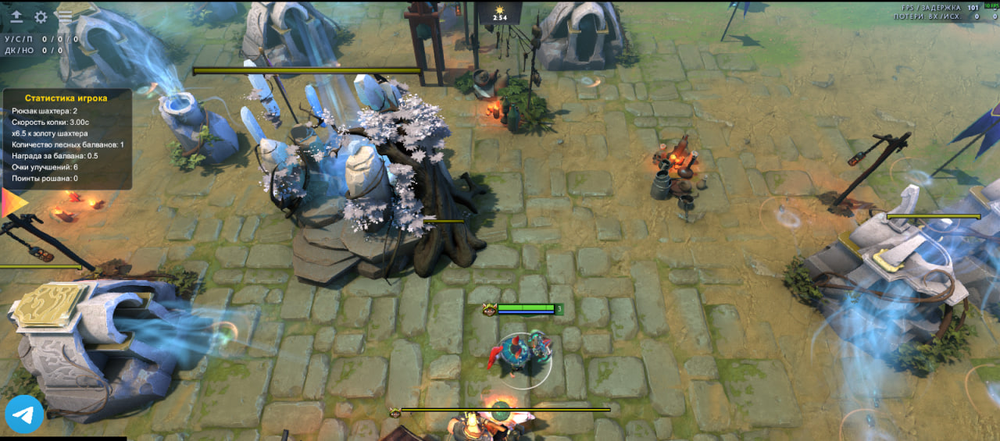     Мы можем обратить внимание, что над менюшкой, где мы прокачиваем или покупаем юнитов находится "статистика игрока".

Вот она поближе

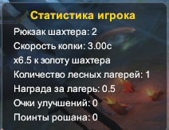

Здесь мы можем увидеть следующую статистику:

1. Статистика по добыче шахтером (до этого мы еще дойдем и поговорим подрпобнее)

2. Статичтика нашего оходника
   
   1. Количество лесных балванов - сколько крипов в ТВОЕМ кемпе для добычи ОУ
   
   2. Награда за балвана - какое кол-во ОУ ты получаешь, если ТЫ или твой ОХОТНИК убивают ТВОЕГО крипа из ТВОЕГО кемпа

3. Очки улучшения - текущее кол-во ОУ

4. Поинты рошана - специальные улучшения, которые нужны для получения спец умений для юнитов (о них подробнее позже)

    После лирического отступления мы возвращаемся к нашему охотнику. Чтобы ускорить добычу ОУ нам нужно его прокачивать. 

    Чтобы это сделать, нам нужно зайти в специтальную вкладку меню "Рабочие". Нас там  встертит вот такая картина:

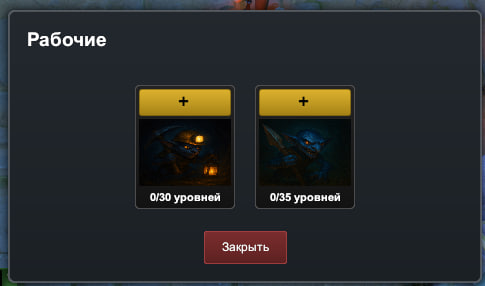

    Чтобы прокачивать рабочего нам нужно тратить на это деньги (про их заработок будет отдельная глава). За улучшение охотника в основном качаются его статы и статы кемпа, в редких случаях увеличивается награда за юнита убитого в вашем кемпе. Чтобы увидеть, что дает улучшение, нужно навестись на иконку нужного вам юнита.

# Глава 2: Ну че там с деньгами?

    У нас есть 4 пути заработка денег: Лес, линия, по которой идут ваши юниты, шахта и грабеж караванов.

## Лес

        Кроме заработка ОУ мы также можем зарабатывать золото, но для этого нужно находиться рядом с любым из существующих там крипов-кабанов во время его смерти, в небольшом радиусе всем игрокам там будет сыпать небольшое количество золота.

## Шахта

    Для более эффективного заработка нужно использовать серьезные методы. У нас и так из шахты идет пассивный заработок, который можно прокачиваить в той же вкладке, что идет прокачка охотника. Но также мы можем зарабатывать в ней самостоятельно. Если вы присмотритесь, то заметите, что шахтер бегает в определенную точку:

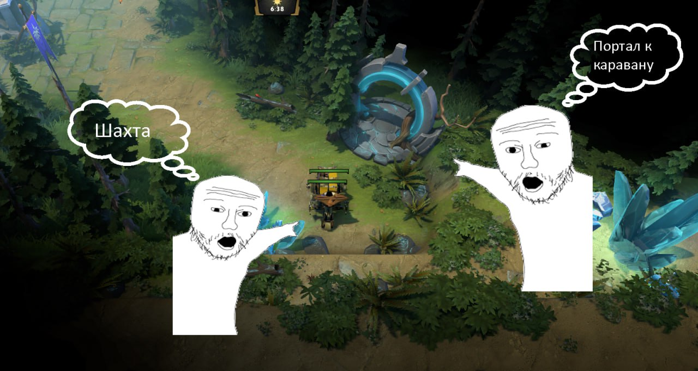

    Если подойти достаточно близко к этому сооружению и иметь один из следующих предметов "Кирка":

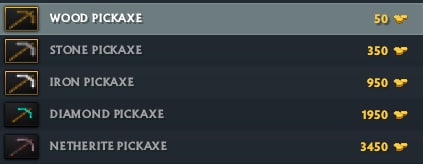

    Вы сможете открыть ее интерфейс и начать зарабытывать, кликая на руду, которая появляется раз в 1.5 секунды. Каждый вид руды приносит разное количество золота. Также разные виды кирок имеют коэф увеличивающий доход от заработка в шахте (увеличивает количество выдаваемого золота за "всопаную" руду).

## Линия битвы

    Если вам не интересно ни помогать своему охотнику, ни сидеть кликать в шахте, то просто идите на линию, где происходят сражения между вами и крипами бота. Если вы будете рядом при смерти крипа, то вы также получите немного золота и из этого будет формироваться ваш доход (золото дается за каждого умершего ВРАЖЕСКОГО крипа в небольшом радиусе)

## Караван

    Это одна из самых азартных вариаций заработка в кастомке. Здесь вам придется рассчитывать стоимость вашего отряда нападения (кнопка в меню "Караван"). Сначала вы формируете отряд нападения (он обнулится после того, как выйдет и нужно будет закупать заново), каждые 3 минуты будут выходить ваш и вражеский отряды и если вы убиваете весь караван противника, то все участники вашей команды получают некоторое количество золото. Здесь вы должны грамотно распределять свои ресурсы, чтобы выйти в плюс.

    Караван будет идти здесь:

    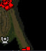

    Чтобы попасть в эту часть карты быстро нужно пройти через этот портал:

    Также когда придет время для каравана, чтобы вам напомнить о нем за 10 секунд до его выхода на карте вам попингует.

# Глава 3: Рошан

    Когда мы разбирали что такое ОУ я подметил, что в статистичке есть Рошан поинты. Чтобы зарабатывать их вам нужно убивать Рошана. Он находится на вершине горы. Он выглядит так:

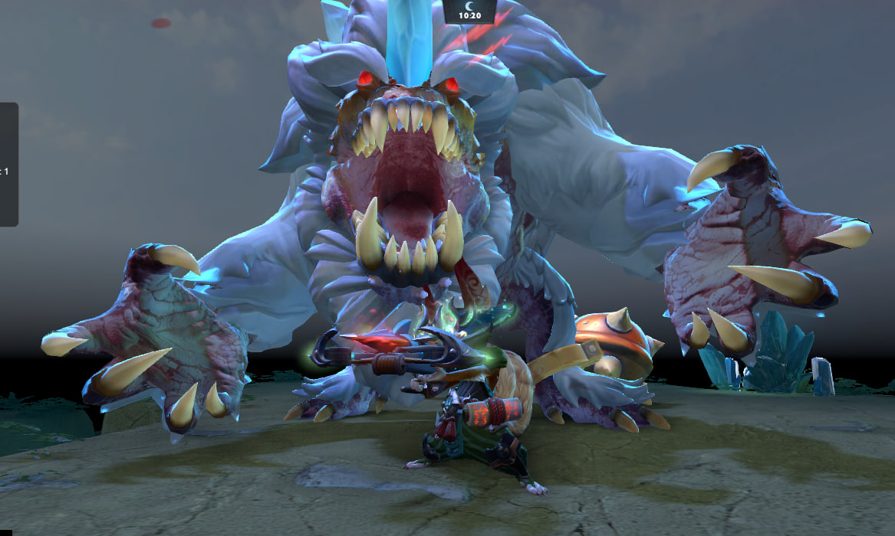

    После его смерти выпадет эгида:

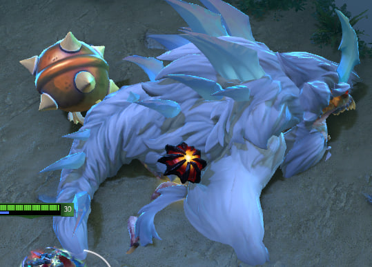

    Вы можете его использовать:

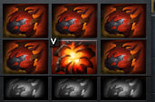

Пассивно оно ничего не дает, но после использования вы получить 1 рошан поинт, который позволит купить одно из спец умений для юнитов (вкладка "Улучшения" - спец умения):

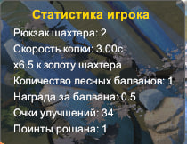

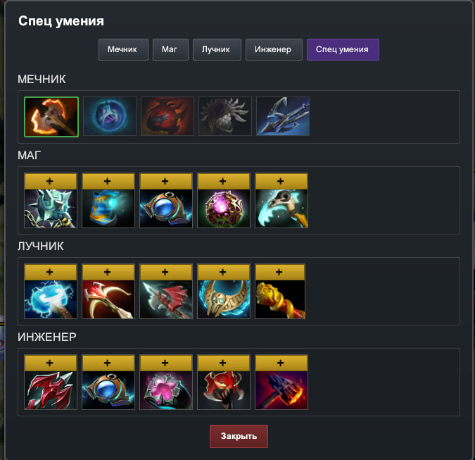

    Их описания также можно прочитать в самой игре.

Вернуться на основную страницу [Главная](../index.md)
